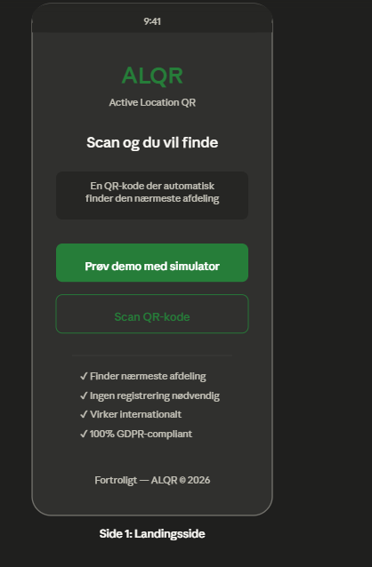
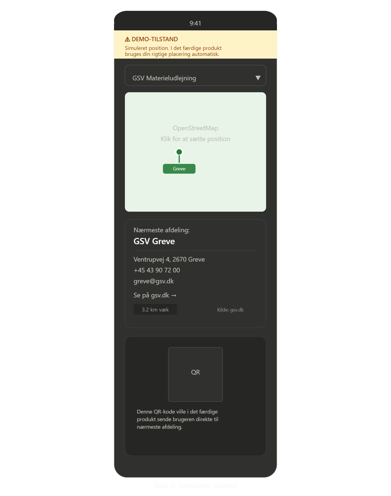
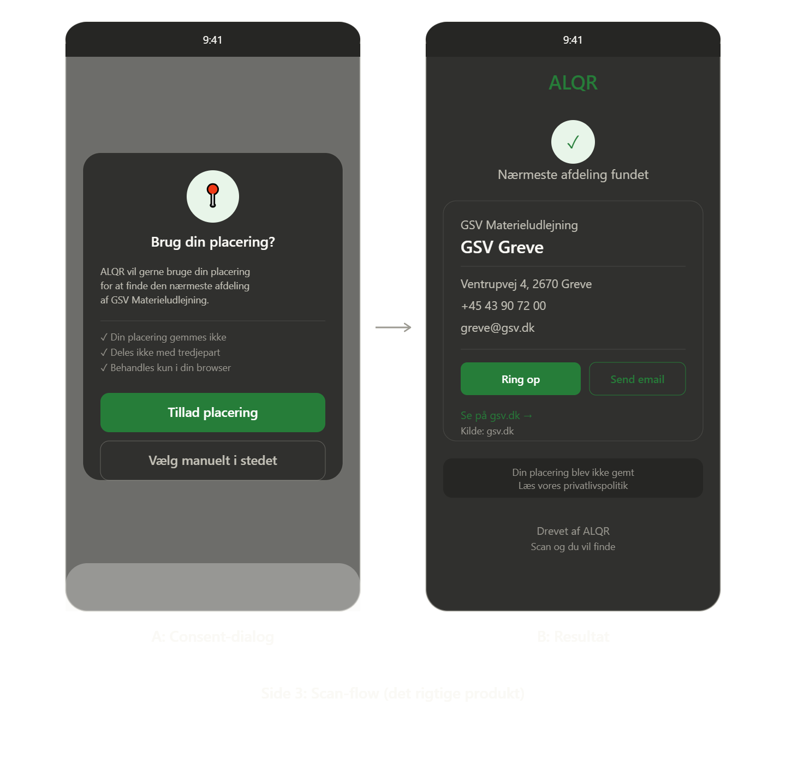
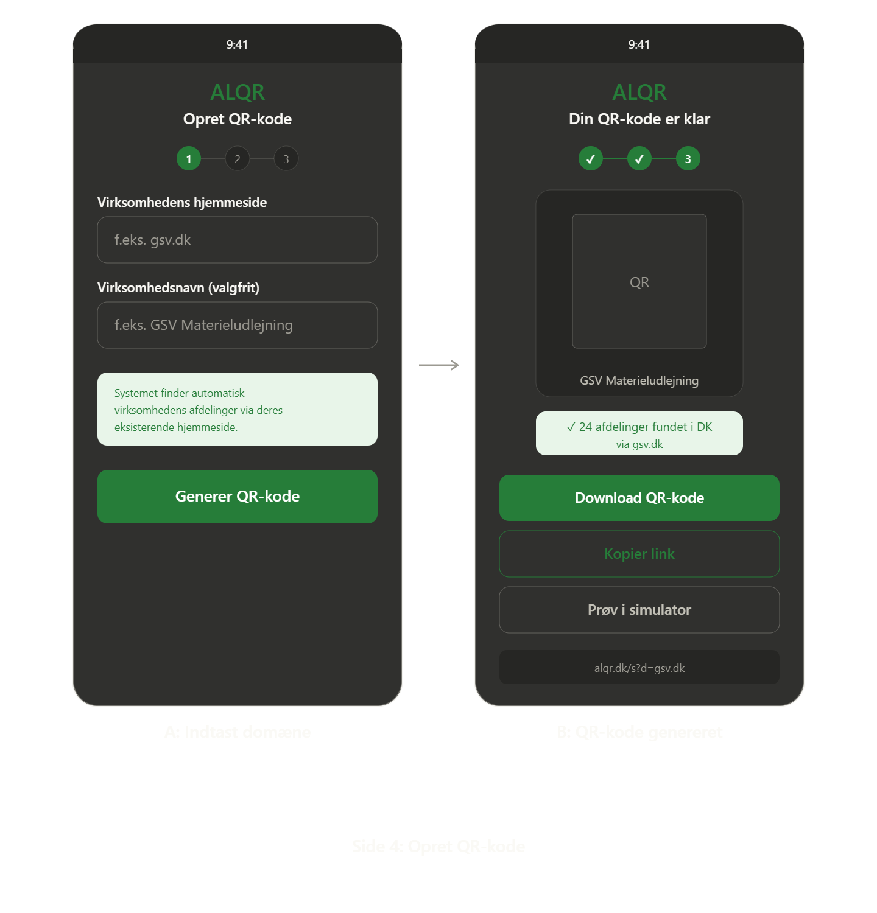

# 📍 ALQR — Active Location QR

**One QR code. Infinite destinations.**

ALQR is a location-aware QR routing service. A company prints a *single* QR code on their trucks, machinery, flyers, or business cards — and every person who scans it is automatically routed to the contact details of the **nearest branch**, based on their real GPS location. Scan it in Copenhagen, get the Copenhagen branch. Scan the same code in Aarhus, get Aarhus.

The best part: the company doesn't integrate anything. ALQR crawls their **existing public website**, uses AI to extract branch data, geocodes it, and turns it into a single smart QR code — automatically.

> 🇩🇰 Built as a working product demo for a real Danish equipment-rental company, showcasing an end-to-end pipeline from web scraping → AI extraction → geocoding → client-side geolocation.

---

## ✨ Key Features

- 🌍 **Location-based QR routing** — one static QR code always resolves to the *nearest* branch, calculated from the scanner's live GPS position.
- 🤖 **Zero-integration onboarding** — no API, no signup. ALQR crawls a company's public website to discover branch/contact pages automatically.
- 🧠 **AI-powered data extraction** — Google Gemini parses messy, unstructured HTML into clean structured branch data (name, address, phone, email), so it works on virtually any website layout without custom scraping rules per site.
- 🗺️ **Automatic geocoding** — addresses are converted to coordinates via OpenStreetMap Nominatim.
- 🔒 **Privacy by design** — nearest-branch matching (Haversine distance) runs **entirely client-side**; no location data is ever sent to or stored on a server. Includes a GDPR-style consent flow before requesting geolocation.
- 🧪 **Interactive simulator** (`/demo`) — a click-to-set-position map (Leaflet + OpenStreetMap) lets you preview results from anywhere in the world without physically travelling.
- 🧾 **QR generator** (`/create`) — turn any company domain into a print-ready, downloadable QR code in a few seconds.
- ⚡ **Caching + graceful fallback** — crawled results are cached for 72 hours; if live crawling or AI extraction fails, the app falls back to a hardcoded dataset and clearly labels the result as "live" vs. "fallback" data in the UI.
- 📱 **Mobile-first, responsive UI** — designed for the primary use case: someone scanning a code on their phone in the field.

---

## 🛠️ Tech Stack

| Category | Technology |
|---|---|
| Framework | [Next.js 15](https://nextjs.org/) (App Router) |
| Language | TypeScript |
| UI | React 19 · Tailwind CSS 4 · [lucide-react](https://lucide.dev/) icons |
| Maps | [Leaflet](https://leafletjs.com/) + OpenStreetMap tiles |
| Geocoding | OpenStreetMap Nominatim API |
| AI extraction | Google Gemini API (`gemini-flash-latest`) |
| Web scraping | [Cheerio](https://cheerio.js.org/) |
| QR generation | [`qrcode`](https://www.npmjs.com/package/qrcode) |
| Analytics | Vercel Analytics |
| Tooling | ESLint 9 |
| Deployment | Vercel |

---

## 🧠 How It Works

```
Company domain (e.g. gsv.dk)
        │
        ▼
1. Crawler (Cheerio)  — fetches the homepage & follows likely branch/contact links
        │
        ▼
2. AI extraction (Gemini) — turns raw HTML into structured branch JSON
        │
        ▼
3. Geocoding (Nominatim) — converts addresses into lat/lng
        │
        ▼
4. Cache (72h TTL) — instant responses on repeat requests
        │
        ▼
   QR code generated → printed on trucks/flyers/etc.
        │
        ▼
Scanner's phone → client-side Haversine distance → nearest branch shown
```

If crawling or AI extraction fails at any step, ALQR transparently falls back to a pre-loaded dataset rather than showing an error — and flags this clearly in the UI so it's obvious when live data isn't being used.

---

## 🚀 Getting Started

### Prerequisites

- Node.js 18.18+ (or 20+)
- A free [Google Gemini API key](https://aistudio.google.com/app/apikey)

### Installation

```bash
git clone https://github.com/TPLilsby/ALQR.git
cd ALQR
npm install
```

### Environment variables

Create a `.env.local` file in the project root:

```bash
GEMINI_API_KEY=your_gemini_api_key_here
```

### Run the dev server

```bash
npm run dev
```

Open [http://localhost:3000](http://localhost:3000) in your browser.

### Other scripts

```bash
npm run build   # production build
npm run start   # run the production build
npm run lint     # lint the codebase
```

### Try it

- `/` — landing page
- `/create` — generate a QR code for any company domain (try `gsv.dk`)
- `/demo` — click-to-simulate-location demo
- `/scan?domain=gsv.dk` — the real end-user scan flow

---

## 📸 Screenshots

<p align="center">
  
  
  
  
</p>

<p align="center">
  <em>Landing page · Simulator · Consent & result · QR generation</em>
</p>

> Screenshots are stored in [`docs/images/`](docs/images). To update them, drop new PNGs in that folder and reference them here with the same `` pattern.

---

## 👨‍💻 About the Developer

Built by **Tobias**, a Danish EUX student specializing in software development, currently apprenticing at **Veng ApS**.

This project was built as a real-world client demo — from initial spec and design system to a working crawler, AI integration, and mobile-first UI — and is shared here as a portfolio piece demonstrating full-stack product thinking, API integration, and shipping something end-to-end under real business constraints.

📫 Open to internship opportunities — feel free to reach out via GitHub.
